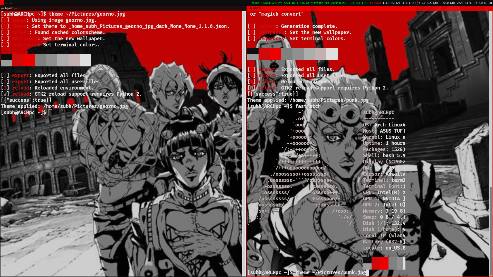
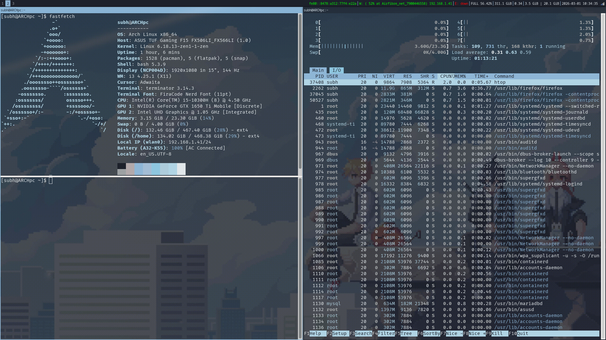
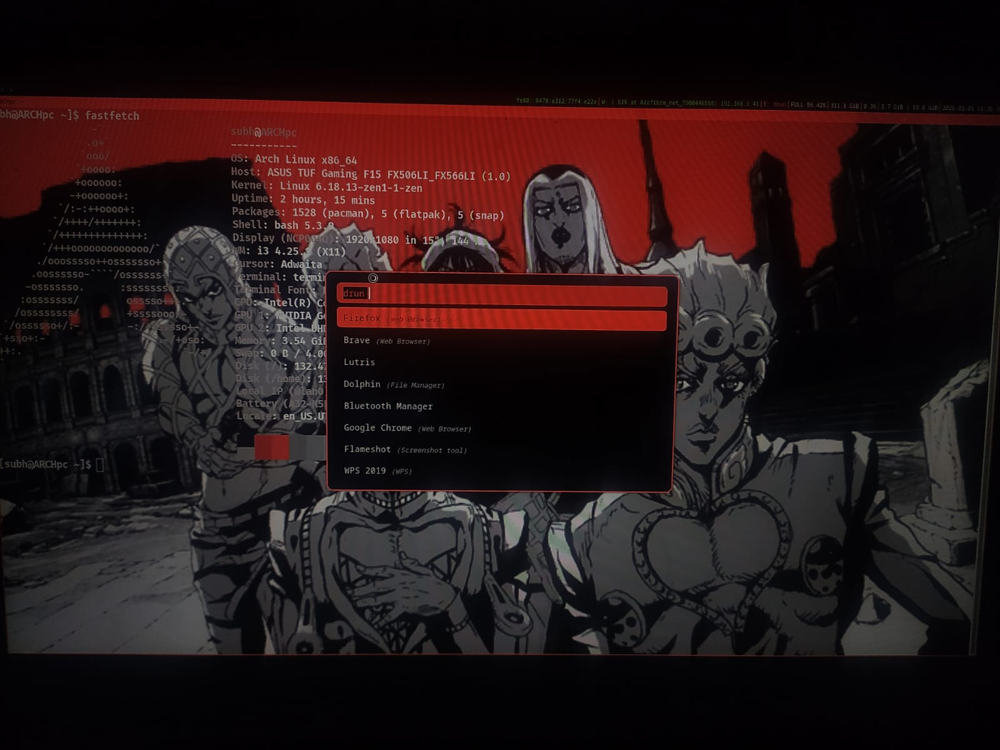

# 🎨 Arch Linux Pywal Rice

> **One command. Entire desktop recolors from your wallpaper.**


---

## 📸 Preview

### Wallpaper Theme


### Theme Switching in Action


### Full Desktop Overview


### ROFI Launcher


---

## ✨ What This Does

```bash
theme ~/Pictures/any-wallpaper.jpg
```

That one command themes your **entire desktop** automatically:

| Component | What gets themed |
|---|---|
| 🖼️ Wallpaper | Set via feh, persists after reboot |
| 🪟 i3 window borders | Accent color extracted from wallpaper |
| 📊 i3bar | Background, text, workspace colors |
| 🚀 Rofi launcher | Full theme — background, accent, hover states |
| 💻 Terminator | 16 terminal colors + 80% transparency |
| 🖥️ Xresources | All terminals updated automatically |
| 🔐 LightDM login | Login screen wallpaper synced separately via `ldm` |
| 🪟 All app windows | Per-app transparency via picom |

No manual hex editing. Ever.

---

## 🎨 The 60/30/10 Rule

This setup follows the classic interior design color rule applied to your desktop:

```
60% ── Background     (dominant — window backgrounds, bar bg)
30% ── Secondary      (panels, inactive elements, inputbar)
10% ── Accent         (borders, selections, highlights, prompt)
```

pywal extracts these automatically from whatever wallpaper you give it.

---

## 🛠️ Scripts Included

| Script | Usage | What it does |
|---|---|---|
| `theme <wallpaper>` | `theme ~/Pictures/forest.jpg` | Changes wallpaper + recolors entire desktop |
| `ldm <wallpaper>` | `ldm ~/Pictures/login.jpg` | Changes only LightDM login screen wallpaper |
| `ricectl` | `ricectl` | Interactive control panel — opacity, brightness, gamma, wallpaper |
| `addapp` | `addapp Gimp 75` | Quickly add any app to picom opacity rules |

---

## 🪟 ricectl — Rice Control Panel

```bash
ricectl
```

An interactive terminal panel to control everything:

```
╔══════════════════════════════════════════════════════════╗
║            RICECTL - Rice Control Panel                  ║
╠══════════════════════════════════════════════════════════╣
║  DISPLAY                                                 ║
║  [1]  Brightness     : 1.0                               ║
║  [2]  Gamma Contrast : 0.8:0.8:0.8                       ║
║                                                          ║
║  WALLPAPER                                               ║
║  [3]  Wallpaper      : star.jpg                          ║
║                                                          ║
║  TERMINAL                                                ║
║  [4]  Terminator     : 0.2 (lower = more transparent)    ║
║                                                          ║
║  APP OPACITY (100=opaque, 70=30% transparent)            ║
║  [5]  firefox        : 70                                ║
║  [6]  Brave          : 70                                ║
║  [7]  Google-chrome  : 70                                ║
║  ...                                                     ║
║  [n]  Add new app                                        ║
║  [a]  Apply ALL changes                                  ║
║  [r]  Reset all opacity to default                       ║
╚══════════════════════════════════════════════════════════╝
```

Pick a number → enter new value → press `y` to apply instantly.

---

## 📦 Requirements

- Arch Linux (or Arch-based: Manjaro, EndeavourOS, etc.)
- i3 window manager
- `yay` AUR helper

---

## 🚀 Installation

### 1. Clone the repo

```bash
git clone https://github.com/YOUR_USERNAME/arch-pywal-rice ~/Downloads/arch-pywal-rice
cd ~/Downloads/arch-pywal-rice
```

### 2. Run the installer

```bash
bash install.sh
```

The installer will:
- Install all required packages (`python-pywal`, `picom`, `terminator`, `rofi`, `feh`, `flameshot`, `ttf-firacode-nerd`)
- Copy all pywal templates to `~/.config/wal/templates/`
- Set up rofi, terminator, picom configs
- Install all scripts (`theme`, `ldm`, `ricectl`, `addapp`) to `~/.local/bin/`
- Add `~/.local/bin` to your PATH

### 3. Apply i3 config

**Option A — Use the included i3 config (replaces yours):**
```bash
cp .config/i3/config ~/.config/i3/config
```

**Option B — Add to your existing i3 config manually:**

Add at the very top of `~/.config/i3/config`:
```
include ~/.cache/wal/colors-i3
```

Add in the exec section:
```
exec_always --no-startup-id bash ~/.fehbg
exec_always --no-startup-id wal -R -s -t
exec_always --no-startup-id picom --config ~/.config/picom/picom.conf --daemon
exec_always --no-startup-id xrandr --output eDP1 --brightness 1.0 --gamma 0.8:0.8:0.8
```

Change terminal keybind to:
```
bindsym $mod+Return exec terminator
```

> ⚠️ **Important:** Remove your existing `bar { }` block — the pywal template manages it now.

### 4. Fix LightDM wallpaper permissions

LightDM cannot read files from your home folder. Always use:

```bash
ldm ~/Pictures/your-login-wallpaper.jpg
```

This copies the wallpaper to `/usr/share/lightdm/wallpapers/` where LightDM can read it.

### 5. Apply your first theme

```bash
theme ~/Pictures/your-wallpaper.jpg
```

Then reload i3 with `Mod+Shift+R`.

---

## 🔄 Daily Usage

```bash
# Change wallpaper + entire desktop theme
theme ~/Pictures/forest.jpg
theme ~/Pictures/city.png
theme ~/Pictures/anime.gif    # GIFs work too!

# Change only login screen
ldm ~/Pictures/login.jpg

# Adjust opacity, brightness, gamma interactively
ricectl

# Add a new app to transparency rules
addapp Gimp 75
addapp discord 70
```

---

## 📁 File Structure

```
arch-pywal-rice/
│
├── README.md
├── install.sh                               ← Run this first
├── .xinitrc                                 ← Restores theme on X startup
│
├── theme/                                   ← Preview screenshots
│   ├── change.png
│   ├── preview 2.png
│   ├── rofi2.jpeg
│   └── theme.png
│
├── .config/
│   ├── i3/
│   │   └── config                           ← Full i3 config with pywal
│   │
│   ├── picom/
│   │   └── picom.conf                       ← Per-app transparency rules
│   │
│   ├── wal/
│   │   └── templates/
│   │       ├── colors-i3                    ← i3 borders + i3bar template
│   │       └── colors-rofi-dark.rasi        ← Rofi theme template
│   │
│   ├── rofi/
│   │   └── config.rasi                      ← Points rofi to pywal theme
│   │
│   └── terminator/
│       └── config                           ← Transparency + base colors
│
└── .local/
    └── bin/
        ├── theme                            ← Master theme switch script
        ├── ldm                              ← LightDM wallpaper changer
        ├── ricectl                          ← Interactive rice control panel
        └── addapp                           ← Quick add app to picom rules
```

---

## ⚙️ How It Works

```
You run:  theme ~/Pictures/wallpaper.jpg
                    │
                    ▼
             pywal extracts
             16 colors from
             the wallpaper
                    │
        ┌───────────┼─────────────┐
        ▼           ▼             ▼
  colors-i3   colors-rofi   Xresources
  written to ~/.cache/wal/
        │           │             │
        ▼           ▼             ▼
   i3 reload   rofi reads    all terminals
  borders+bar  on next        update
               launch         colors
```

pywal fills your templates with real hex values and drops them in `~/.cache/wal/`. Each app reads from there automatically.

---

## 🪟 Per-App Transparency

Managed by picom. Every app has its own opacity setting:

| App | Default Opacity |
|---|---|
| firefox, Brave, Chrome | 70% |
| code-oss | 70% |
| Terminator | 70% (+ terminator native transparency) |
| Thunar, Dolphin | 70% |
| Spotify, Telegram, Zoom | 70% |
| mpv, vlc, feh | 100% (media stays opaque) |

To change any app's opacity:
```bash
ricectl       # interactive panel
addapp ClassName 85   # direct one-liner
```

To find any app's class name:
```bash
xprop | grep WM_CLASS
# then click on the app window
```

---

## ⌨️ Keybindings (i3)

| Keys | Action |
|---|---|
| `Mod+Return` | Open Terminator |
| `Mod+D` | Open Rofi launcher |
| `Mod+Shift+Q` | Close window |
| `Mod+Shift+R` | Restart i3 |
| `Mod+Shift+C` | Reload i3 config |
| `Print` | Screenshot (flameshot) |
| `Mod+1..0` | Switch workspace |
| `Mod+Shift+1..0` | Move window to workspace |
| `Mod+F` | Fullscreen toggle |
| `Mod+H/V` | Split horizontal/vertical |
| `Mod+R` | Resize mode |

> `Mod` key is set to **Alt** (`Mod1`). Change to Super/Windows key by replacing `Mod1` with `Mod4` in i3 config.

---

## 🔧 Troubleshooting

### Black screen on LightDM login
LightDM cannot read files from your home folder. Always set login wallpaper with:
```bash
ldm ~/Pictures/wallpaper.jpg
```
This copies the file to `/usr/share/lightdm/wallpapers/` where LightDM has read access.

### Rofi errors on launch
```bash
cat ~/.cache/wal/colors-rofi-dark.rasi
# If empty, regenerate:
wal -i ~/Pictures/your-wallpaper.jpg
```

### Terminator not transparent
```bash
pgrep picom && echo "running" || picom --daemon &
```

### picom fails on NVIDIA
The config uses `xrender` backend to avoid NVIDIA driver issues:
```bash
grep backend ~/.config/picom/picom.conf
# Should show: backend = "xrender";
```

### i3 bar not themed
```bash
head -5 ~/.config/i3/config        # include must be at top
grep -n "^bar" ~/.config/i3/config # old bar{} must be removed
```

### `theme` command not found
```bash
source ~/.zshrc
# or run directly:
~/.local/bin/theme ~/Pictures/wallpaper.jpg
```

### Colors look washed out
```bash
wal -i ~/Pictures/wallpaper.jpg --saturate 0.7
```

### FiraCode font not rendering
```bash
fc-list | grep -i fira
fc-cache -fv
```

---

## 🙏 Credits

- [pywal](https://github.com/dylanaraps/pywal) — color extraction engine
- [i3wm](https://i3wm.org/) — window manager
- [rofi](https://github.com/davatorium/rofi) — application launcher
- [picom](https://github.com/yshui/picom) — compositor for transparency and blur
- [feh](https://feh.finalrewind.org/) — wallpaper setter
- [terminator](https://gnome-terminator.org/) — terminal emulator

---

## 📄 License

MIT — use it, fork it, make it yours.
